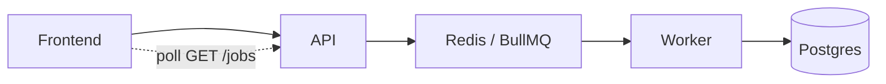
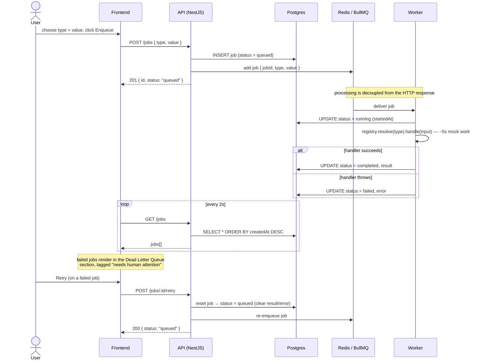

# Job Processor

A REST API backed by an async job queue. Jobs are submitted over HTTP and processed in the background by a separate worker; clients poll for status and results. Failed jobs land in a **Dead Letter Queue** section in the UI and can be retried.

- **api/** — NestJS REST API. Accepts a job, persists it as `queued`, enqueues it, and returns the job id immediately (processing is decoupled from the HTTP response). Owns the DB schema (migrations).
- **worker/** — Headless NestJS worker. Pulls jobs from BullMQ, dispatches by job `type` (Strategy + Registry), computes the result, and persists `running -> completed | failed`.
- **frontend/** — Vite + React + Redux Toolkit Query. Enqueue jobs and watch them move across Queued / Running / Completed columns via polling, with a Dead Letter Queue section for failed jobs.
- **Postgres** is the source of truth for status/results; **Redis / BullMQ** is the queue.

Supported job types: `square` (n²) and `prime` (is n prime?).

## Stack

TypeScript, NestJS, BullMQ, TypeORM, Postgres, Redis, React, Redux Toolkit Query, Docker Compose.

## Architecture



```text
Frontend      →       API    →  Redis / BullMQ  →  Worker  →  Postgres
    ↑                                                  
    └─ poll GET /jobs ────┘
```

## Request → queue → worker flow

The HTTP request returns as soon as the job is persisted and enqueued. Everything after that is asynchronous.



## API

The API listens on the `PORT` from `api/.env` (currently **3002**).

| Method | Path              | Description                                             |
| ------ | ----------------- | ------------------------------------------------------- |
| POST   | `/jobs`           | `{ "type": "square", "value": 9 }` → job id (immediate) |
| GET    | `/jobs`           | list all jobs (newest first)                            |
| GET    | `/jobs/:id`       | single job with status + result                         |
| POST   | `/jobs/:id/retry` | re-queue a **failed** job under its existing id         |

`type` is optional and defaults to `square`. Allowed values: `square`, `prime`.

Example:

```bash
curl -X POST http://localhost:3002/jobs \
  -H 'content-type: application/json' \
  -d '{ "type": "prime", "value": 7 }'
# -> { "id": "...", "status": "queued", ... }   (returns immediately)
```

Within ~5 seconds the job transitions `queued -> running -> completed`, with `result.square` (square jobs) or `result.isPrime` (prime jobs). If the handler throws, the job becomes `failed` and appears in the Dead Letter Queue, where it can be retried.

## Run commands

The backend runs entirely in Docker Compose with hot reload (Postgres, Redis, API, worker). Source is bind-mounted. The frontend runs on the host.

```bash
make install     # install node deps on the host (for local runs / tests)
make up          # build + start Postgres, Redis, API, worker (foreground, hot reload)
make up-detached # same, in the background
make frontend    # in another terminal: run the React app -> http://localhost:5173
make logs        # tail API + worker logs
make infra       # only Postgres + Redis (e.g. to run API/worker on the host)
```

- Frontend: http://localhost:5173
- API: http://localhost:3002

To run a backend service on the host instead of Docker: `make infra`, then `cd api && npm run start:dev` (the host `.env` points `POSTGRES_HOST` / `REDIS_HOST` at `localhost`).

## Test commands

```bash
make test             # unit tests across api, worker, and frontend (host, no external deps)
make test-integration # API HTTP integration tests (Testcontainers; requires Docker)

# or per project:
cd api && npm test
cd worker && npm test
cd frontend && npm test
cd api && npm run test:integration
```

### Test scenarios covered

**Unit tests** (co-located `__tests__/`, fast, fully mocked):

- **API — `JobsService`** (`api/src/jobs/__tests__/jobs.service.spec.ts`)
  - persists a `queued` record and enqueues the job with the correct payload
  - returns immediately without awaiting any processing (fire-and-return)
  - throws `NotFoundException` for an unknown job id
- **Worker — `JobHandlerRegistry`** (`worker/src/jobs/__tests__/registry.spec.ts`)
  - resolves a registered handler by job type
  - throws for an unregistered job type
- **Worker — `SquareJobHandler`** (`worker/src/jobs/handlers/__tests__/square-handler.spec.ts`)
  - exposes the `square` job type
  - computes the square of the input value
  - handles negative values
- **Frontend — `groupByStatus`** (`frontend/src/lib/__tests__/group.spec.ts`)
  - buckets jobs by their status
  - returns empty buckets when there are no jobs

**Integration tests** (`api/test/jobs.integration-spec.ts`) — boot the real Nest app against ephemeral Postgres + Redis via [Testcontainers](https://node.testcontainers.org/), run migrations, and exercise the HTTP layer end to end:

- `POST /jobs` persists a `queued` job and enqueues it (verified against BullMQ counts)
- request-body validation rejects a missing `value` with `400`
- `GET /jobs/:id` returns the persisted job
- `GET /jobs` lists persisted jobs, newest first
- `GET /jobs/:id` returns `404` for an unknown id

## Stop commands

```bash
make down    # stop and remove all containers
make clean   # remove node_modules and dist from all projects
```

- `make up` runs in the foreground — press `Ctrl-C` to stop it (then `make down` to remove containers).
- The frontend dev server (`make frontend`) stops with `Ctrl-C`.

## Database migrations

The **API** is the single owner of the database schema. It runs TypeORM migrations on startup (`migrationsRun: true`, `synchronize: false`), so the `jobs` table is created and evolved in one place. The **worker** never creates or migrates schema; it only reads/writes the existing table.

```bash
cd api
npm run migration:run       # apply pending migrations (also runs automatically on API boot)
npm run migration:revert    # roll back the last migration
# after changing the entity, generate a new migration:
npm run migration:generate -- src/migrations/DescribeChange
```

Migrations live in `api/src/migrations/`.

## Design patterns

- **Strategy** — one `JobHandler` per job type (`SquareJobHandler`, `PrimeJobHandler`), behind a shared interface.
- **Factory / Registry** — `JobHandlerRegistry` resolves the handler for a job type at runtime; new types are added as new classes without editing the processor.
- **Producer-Consumer** — the API produces jobs onto BullMQ; the worker consumes them. This decouples processing from the HTTP response.
- **Dependency Injection / IoC** — NestJS wires services, repositories, and handlers.
- **Repository** — TypeORM repositories abstract Postgres access.
- **DTO / Data Mapper**, **Module pattern**, and **Observer / polling** (BullMQ events + RTK Query polling).

## Adding a new job type

1. Add the type to `JobType` (api + worker + frontend `types.ts`).
2. Implement a new `JobHandler` in `worker/src/jobs/handlers/`.
3. Register it in `worker/src/jobs/jobs.module.ts` (add to providers and the `JOB_HANDLERS` factory inject list).
4. If the result has a new shape, extend `JobResult` and add a migration if the DB enum changes.

No changes to the processor are required.
